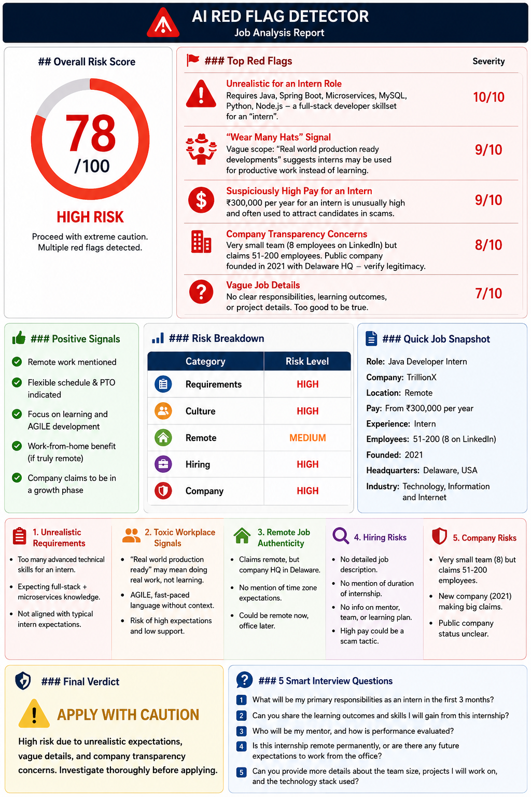

# Day 60 - Claude Challenge: AI Red Flag Detector

## Prompt Used:
You are an AI Red Flag Detector for job seekers.
Analyze the Job Description and Company Information.
Identify:
1. Unrealistic Requirements
- Excessive experience for the role
- Too many skills/responsibilities
- Contradictory expectations
2. Toxic Workplace Signals
- Burnout indicators
- 'Wear many hats'
- 'Fast-paced', 'rockstar', 'hustle culture'
- Poor work-life balance signals
3. Remote Job Authenticity
- Hidden office requirements
- Relocation expectations
- Misleading remote claims
4. Hiring Risks
- Missing salary information
- Vague responsibilities
- Excessive qualifications
- Suspicious hiring practices
5. Company Risks
- Reputation concerns
- Stability concerns
- Growth or layoff indicators
Output:
## Overall Risk Score (0-100)
### Top Red Flags
- List with severity (1-10)
### Positive Signals
- List positives
### Risk Breakdown
| Category | Risk Level |
|-----------|-----------|
| Requirements | |
| Culture | |
| Remote | |
| Hiring | |
| Company | |
### Final Verdict
✅ Apply
⚠️ Apply with Caution
❌ Avoid
### 5 Smart Interview Questions
Generate questions that help validate the identified risks.
Job Description:[Put Job Description here]
Company Information: [Put company information here]
# Risk Analysis Report

## Overall Risk Score
**78/100 (High Risk)**

## Final Verdict
⚠️ **Apply with Caution**

### Top Red Flags
1. Unrealistic expectations for an intern role.
2. Broad technology stack suggesting multiple responsibilities.
3. Vague internship scope and deliverables.
4. Company transparency concerns.
5. Limited information about mentorship and learning outcomes.

### Positive Signals
- Remote work offered.
- Flexible schedule.
- Paid time off.
- Focus on Agile development and learning.
- Internship appears paid.

---

# Risk Breakdown

| Category | Risk Level |
|-----------|------------|
| Requirements | High |
| Culture | High |
| Remote | Medium |
| Hiring | High |
| Company | High |

---

# Smart Interview Questions

1. What will be my primary responsibilities during the first three months?
2. Who will mentor interns and how is progress evaluated?
3. Can you describe a typical work week for an intern?
4. Is the position fully remote long-term or could relocation be required later?
5. What projects will interns contribute to and what technologies are actually used daily?

---

# Screenshot

---

# Key Learnings

- Internship titles do not always reflect actual expectations.
- A long technology stack can indicate role ambiguity.
- Company size and public claims should be independently verified.
- Remote opportunities should be checked for hidden office requirements.
- Asking targeted interview questions can uncover hidden risks before accepting an offer.

