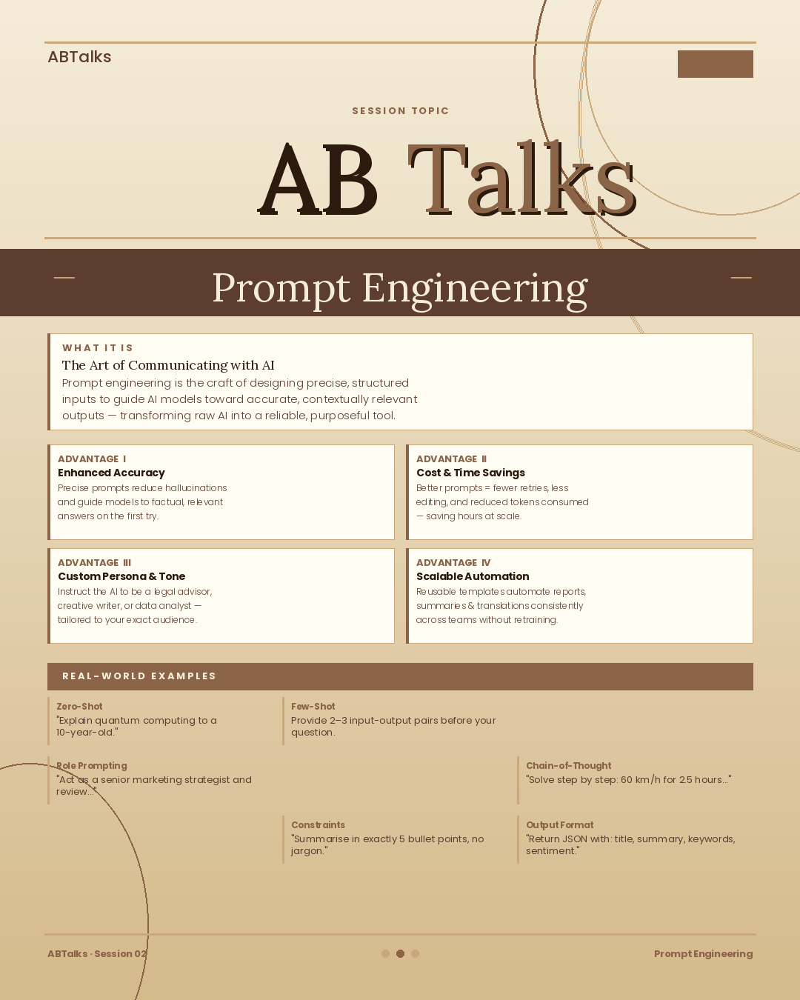

## Day 2 : Importance of Prompt Engineering

# Normal Prompt:
create an image which says title as ABTalks in the middle and Day 2 at the top right corner. Color of the image should be brown-beige-cream. Explain prompt engineering, its advantages and examples. Title of the image should be Prompt Engineering. Give me just one image in the output based on the description provided

# Normal Output:

# Engineered Prompt:
You are an AI educator teaching complete beginners.
Explain Prompt Engineering in simple language.
Include:
* What Prompt Engineering is
* Why it matters when using AI tools like Claude
* One example of a weak prompt
* One example of an improved prompt
* Three practical benefits of writing better prompts
Also create a LinkedIn-ready image concept.
Image Requirements:
* Square LinkedIn post (1080×1080)
* Claude-inspired brown, beige and cream colors
* Professional and minimal design
* Main title: "Prompt Engineering"
* Show a visual comparison:
  * Weak Prompt → Basic Output
  * Engineered Prompt → Better Output
* Modern AI and productivity-themed visuals
add abtalks 60 days claude challenge in the heading
Output Format:
Section 1: Explanation
Section 2: Weak vs Improved Prompt Example
Section 3: Detailed Image Generation Prompt

You only have to give 1 image as an output which follows "Image Requirements" given about and includes details mentioned in "Include" section.

# Engineered Output:
