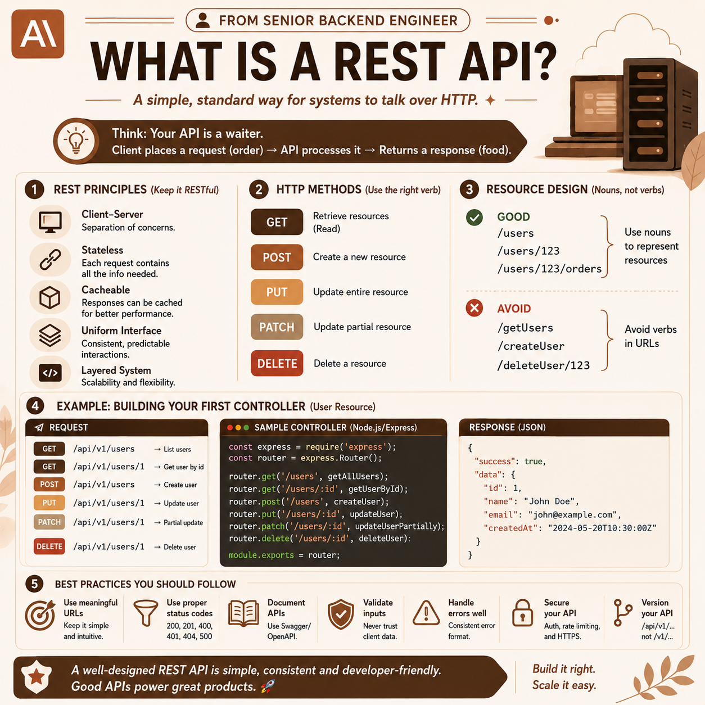
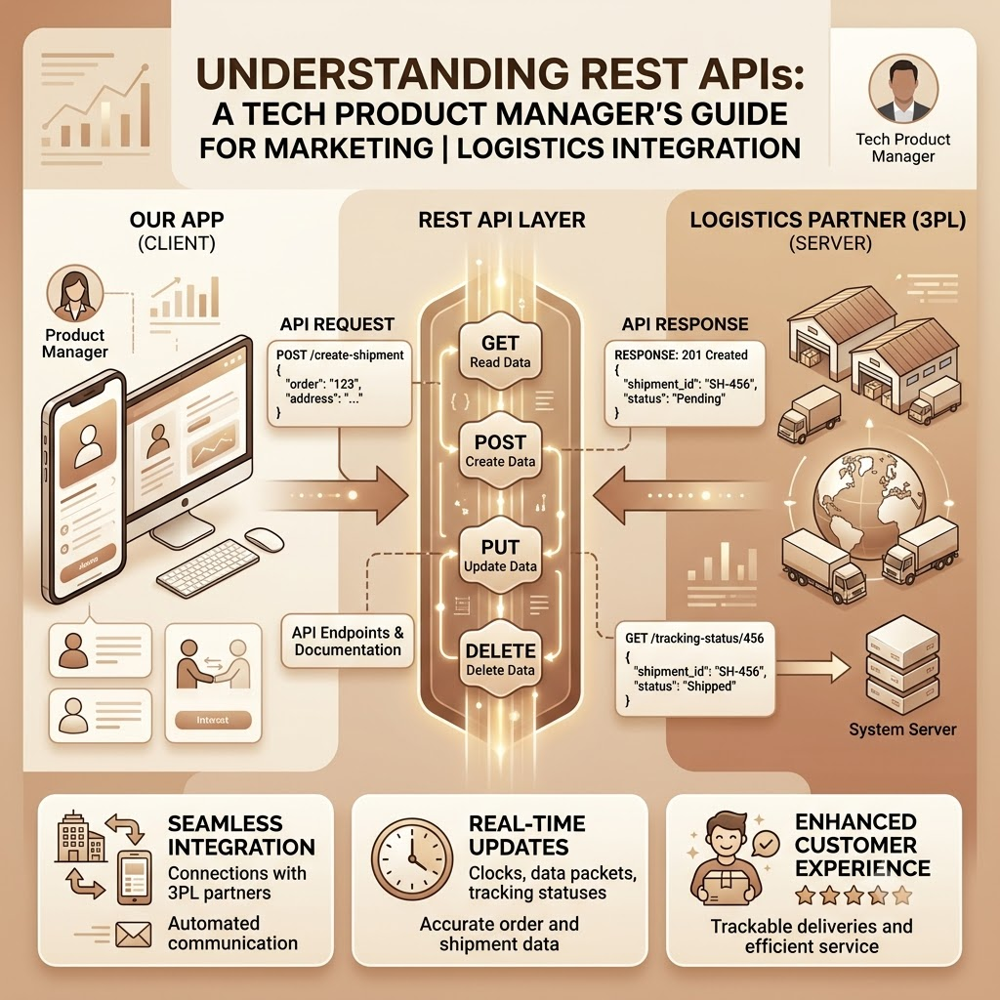
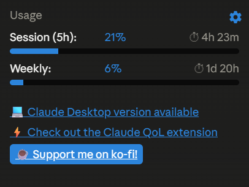

# 60 Days Claude Challenge - Day 3 

Hey everyone! Back with Day 3 of the 60 Days Claude Challenge. Juggling this alongside my college projects and technical placement prep, but I'm really seeing the value in refining my prompts. Today's focus was all about **Role-Based Prompting**!

## 🧪 Role-Based Prompting Experiments

I decided to test how well Claude can adopt different professional personas. I used topics I'm currently studying to see if the responses felt authentic.

### Experiment 1: Senior Backend Engineer Explaining REST APIs
**Prompt:**
> "Act as a Senior Backend Engineer. Explain what a REST API is to a junior developer who is about to build their first controller. Focus on practical implementation details and industry best practices."

**Result/Observation:**
Claude nailed the tone. It explained REST APIs in detail: REST principles, REST API methods, Resource Design along with examples, just what is exactly necessary for junior developers.

### Experiment 2: Tech Project Manager Explaining REST APIs to Non-Tech people
**Prompt:**
> "Act as a Tech Product Manager. Explain what a REST API is to a non-technical marketing stakeholder who wants to understand how our app connects with third-party logistics partners."

**Result/Observation:**
By assigning the "Tech Product Manager" role, and audience as Marketing stakeholders, who do not have tech background, it explained in easy to understand manner, which can be understood by anyone irrespective of educational background.

---

## 📸 Claude Usage Counter Screenshots

---

## 💡 Key Learnings from Day 3

1. **Persona Formatting Matters:** Giving Claude a specific title (e.g., "Strict Technical Interviewer" instead of just "Interviewer") drastically changes the tone and depth of the response.
2. **Contextual Boundaries:** When asking Claude to act as a code reviewer, telling it the *context* of the project helped it provide domain-specific advice rather than generic Java tips.
3. **Interactive Roles:** Prompting Claude to "wait for my answer" turns a static prompt into a dynamic learning session, which is amazing for practicing communication.

# Resources:

1) https://www.geeksforgeeks.org/artificial-intelligence/role-based-prompting/
2) https://learnprompting.org/docs/advanced/zero_shot/role_prompting?srsltid=ARcRdnp2kjruYDfuJaffv7pg3K5TkBuT71Ejarwpte2Uwdkf-RxbiqSu
