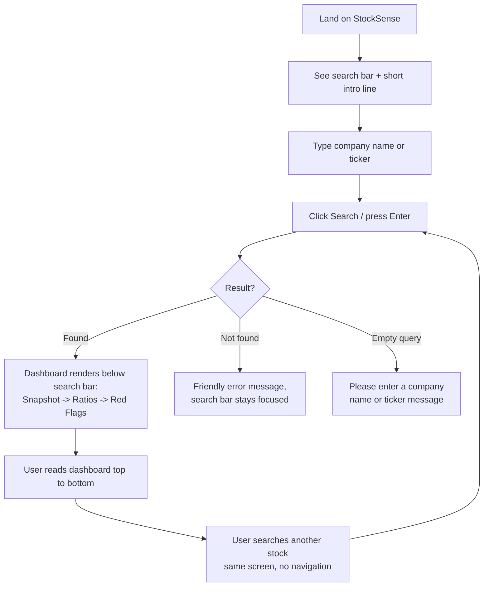

# UI-WIREFRAMES.md — StockSense

**Status:** Finalized Day 2. Single-screen product — this is deliberate (per PRD North Star: "all decision-critical info visible without navigating").

---

## 1. User Flow Diagram



There is exactly **one screen** in v1.0. "Navigation," in the traditional sense, does not exist — the entire product is a single page that re-renders its results area on each search. This is a direct, literal implementation of the founder's stated Day 1 success criterion.

---

## 2. Screen Flow

Only one real screen state machine exists, with **four states of the same screen**:

| State | Trigger | What's shown |
|---|---|---|
| **Idle** | Page load, before any search | Search bar + one-line intro copy ("Search any major NSE stock to see a plain-English health check"). Results area empty. |
| **Loading** | User has submitted a search | Search bar (disabled briefly) + a lightweight loading indicator in the results area. |
| **Results** | Matching stock found | Full dashboard: Snapshot card → Ratios section → Red Flags section, in that fixed order. |
| **Error** | No match, or empty query | Search bar (active, focused) + a single friendly message in the results area. No dashboard sections shown. |

---

## 3. Low-Fidelity Wireframe — Idle State

```
┌──────────────────────────────────────────────────────────┐
│  StockSense                                               │
│  Understand any Indian stock in one glance                │
│                                                            │
│  ┌──────────────────────────────────────┐  ┌───────────┐  │
│  │  Search a company or ticker (e.g. TCS)│  │  Search   │  │
│  └──────────────────────────────────────┘  └───────────┘  │
│                                                            │
│         (empty — nothing searched yet)                    │
│                                                            │
└──────────────────────────────────────────────────────────┘
```

## 4. Low-Fidelity Wireframe — Results State (Core v1.0)

```
┌──────────────────────────────────────────────────────────┐
│  StockSense                                               │
│  ┌──────────────────────────────────────┐  ┌───────────┐  │
│  │  TCS                                  │  │  Search   │  │
│  └──────────────────────────────────────┘  └───────────┘  │
│                                                            │
│  ── COMPANY SNAPSHOT ─────────────────────────────────── │
│  Tata Consultancy Services Ltd.  (TCS)                     │
│  ₹3,845.20        Market Cap: ₹13.91 Lakh Cr               │
│  Sector: Information Technology                            │
│  "India's largest IT services and consulting company..."   │
│  Data as of: 15 Jul 2026                                   │
│                                                            │
│  ── KEY RATIOS, EXPLAINED ────────────────────────────── │
│  P/E Ratio        28.4     [ Average ]                     │
│    How much investors pay for each ₹1 of profit...          │
│  EPS              ₹135.50  [ Good ]                         │
│    Earnings generated per share...                          │
│  Dividend Yield   1.6%     [ Average ]                      │
│    ...                                                       │
│  Debt-to-Equity   0.02     [ Good ]                          │
│    ...                                                       │
│  ⚠ These are simplified educational guidelines, not          │
│     financial advice.                                        │
│                                                            │
│  ── RED FLAGS ──────────────────────────────────────────  │
│  ✓ No major red flags detected                             │
│                                                            │
└──────────────────────────────────────────────────────────┘
```

## 5. Low-Fidelity Wireframe — Error State

```
┌──────────────────────────────────────────────────────────┐
│  StockSense                                               │
│  ┌──────────────────────────────────────┐  ┌───────────┐  │
│  │  xzzstock                             │  │  Search   │  │
│  └──────────────────────────────────────┘  └───────────┘  │
│                                                            │
│        Couldn't find that stock.                          │
│        Check the spelling or try a different ticker        │
│        (e.g. TCS, INFY, RELIANCE).                          │
│                                                            │
└──────────────────────────────────────────────────────────┘
```

## 6. Mobile / Narrow-Width Wireframe (Results State, Stacked)

```
┌───────────────────────┐
│  StockSense           │
│ ┌───────────────────┐ │
│ │ TCS               │ │
│ └───────────────────┘ │
│ [   Search   ]        │
│                       │
│ ── SNAPSHOT ────────  │
│ TCS · ₹3,845.20       │
│ Mkt Cap: ₹13.91 LCr   │
│ IT Sector             │
│ "India's largest..."  │
│                       │
│ ── RATIOS ──────────  │
│ P/E: 28.4 [Average]   │
│ EPS: ₹135.5 [Good]    │
│ Div Yld: 1.6% [Avg]   │
│ D/E: 0.02 [Good]      │
│                       │
│ ── RED FLAGS ───────  │
│ ✓ None detected       │
└───────────────────────┘
```
Sections stack vertically in the same fixed order (Snapshot → Ratios → Red Flags); nothing moves to a separate page or hidden tab. This preserves the "no navigating" principle at every screen width.

---

## 7. Navigation

There is **no navigation menu, no tabs, no routing** in v1.0. The only interactive elements on the entire site are:
1. The search input
2. The search button (Enter key does the same thing)

This is intentional and directly traceable to the founder's stated Day 1 definition of success: *"It is done when I can see all important things easily visible in front of my eyes without navigating too much."* Every wireframe above honors that by keeping everything on one continuously-updating screen.

## 8. Why Every Screen State Exists

| State | Reason it must exist |
|---|---|
| Idle | First-time users need to know what to do — an empty results area with no guidance would be confusing. |
| Loading | Even a fast local JSON lookup benefits from a brief, deliberate loading state so the UI doesn't feel broken/unresponsive on click. |
| Results | The core value of the product — required. |
| Error | Beginners will mistype tickers; a harsh browser error or blank screen would break trust immediately. |

No additional screens (settings, login, about page, etc.) exist, matching the PRD's explicit out-of-scope list.