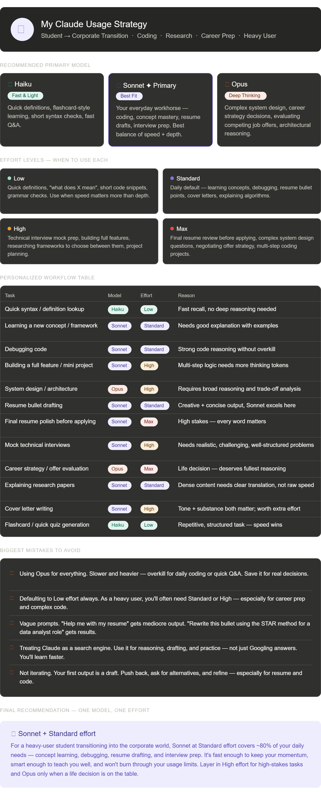

# Day 7: Claude Model Selection & Reasoning Effort

## 🎯 Objective
Understand when to use Haiku, Sonnet, and Opus, and how to effectively utilize different reasoning effort levels (Low, Standard, High, Max) to optimize daily workflows, coding tasks, and career preparation.

## 🖼️ Strategy Overview

## 🧠 My Claude Usage Strategy

### Recommended Primary Model: Claude Sonnet
**Why This Model Fits Me:**
Sonnet is my everyday workhorse. It provides the best balance of speed and depth for concept mastery, debugging Java backend projects, drafting resumes, and technical interview prep.

### Model Breakdown
*   **When to Use Haiku (Fast & Light):** Quick definitions, flashcard-style learning, short syntax checks, and fast Q&A.
*   **When to Use Sonnet (Best Fit):** Everyday coding, learning frameworks, resume drafting, and mock interviews.
*   **When to Use Opus (Deep Thinking):** Complex system design, career strategy decisions, evaluating competing job offers, and architectural reasoning.

### Recommended Effort Levels
*   **Low:** Quick definitions, short code snippets, and grammar checks. Use when speed matters more than depth.
*   **Standard:** My daily default — learning concepts, debugging algorithms, and writing cover letters.
*   **High:** Technical interview mock prep, building full-stack features, researching frameworks, and project planning.
*   **Max:** Final resume reviews before applying, complex system design questions, and multi-step coding projects.

---

## ⚙️ My Personalized Claude Workflow

| Task | Best Model | Best Effort | Reason |
| :--- | :--- | :--- | :--- |
| Quick syntax / definition lookup | Haiku | Low | Fast recall, no deep reasoning needed |
| Learning a new concept / framework | Sonnet | Standard | Needs good explanation with examples |
| Debugging code | Sonnet | Standard | Strong code reasoning without overkill |
| Building a full feature / mini project | Sonnet | High | Multi-step logic needs more thinking tokens |
| System design / architecture | Opus | High | Requires broad reasoning and trade-off analysis |
| Resume bullet drafting | Sonnet | Standard | Creative + concise output, Sonnet excels here |
| Final resume polish before applying | Sonnet | Max | High stakes — every word matters |
| Mock technical interviews | Sonnet | High | Needs realistic, challenging, well-structured problems |
| Career strategy / offer evaluation | Opus | Max | Life decision — deserves fullest reasoning |
| Explaining research papers | Sonnet | Standard | Dense content needs clear translation, not raw speed |
| Cover letter writing | Sonnet | High | Tone + substance both matter; worth extra effort |
| Flashcard / quick quiz generation | Haiku | Low | Repetitive, structured task — speed wins |

---

## 🚫 Biggest Mistakes I Should Avoid

1.  **Using Opus for everything:** It is slower, heavier, and overkill for daily coding or quick Q&A. Save it for real decisions.
2.  **Defaulting to Low effort always:** As a heavy user, I will often need Standard or High — especially for technical placement prep and complex code.
3.  **Vague prompts:** "Help me with my resume" gets mediocre output. "Rewrite this bullet using the STAR method for a software engineer role" gets results.
4.  **Treating Claude as a search engine:** Use it for reasoning, drafting, and practice — not just Googling answers. Active learning is key.
5.  **Not iterating:** The first output is a draft. Push back, ask for alternatives, and refine — especially for resume metrics and algorithmic efficiency.

## 🏆 Final Recommendation

**Sonnet + Standard effort**

For a heavy-user student transitioning into the corporate tech world, Sonnet at Standard effort covers ~80% of daily needs. It's fast enough to keep momentum while debugging or studying, smart enough to teach complex topics well, and efficient enough to manage usage limits. Layer in High/Max effort only when high-stakes career decisions or complex system designs are on the table.

# Resources

1) https://claude.com/resources/tutorials/choosing-the-right-claude-model
2) https://platform.claude.com/docs/en/about-claude/models/choosing-a-model
